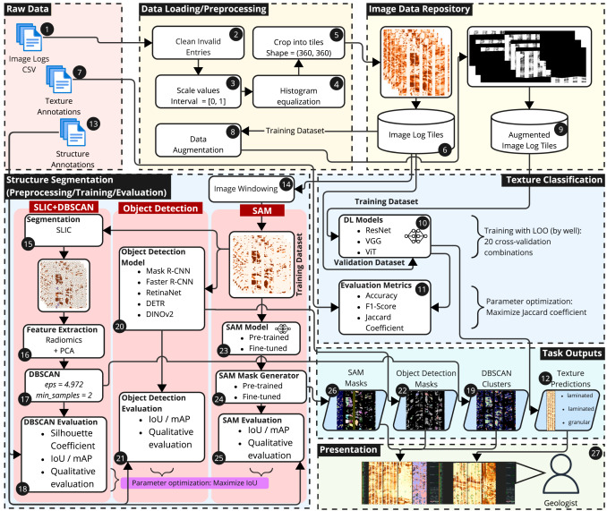

# PATSA-BIL: Pipeline for Automated Texture and Structure Analysis of Borehole Image Logs

This repository contains the code and data for the PATSA-BIL project, which focuses on the automated analysis of borehole image logs. The project includes various preprocessing and classification pipelines, as well as segmentation methods for analyzing borehole images.

<div align="center">
    
</div>

## Highlights

- We propose PATSA-BIL, a robust pipeline for analyzing resistivity image log data.
- PATSA-BIL achieved up to 90% accuracy in texture classification using ViT models.
- PATSA-BIL with SLIC+DBSCAN outperformed baseline DINOv2 by up to 16% (mAP).
- A Wilcoxon–Holm analysis confirmed the significance and stability of our approach.

## Citing

If you find this repository useful for your research, please consider citing our paper:

<!-- TODO: Update Citing BibTeX reference-->
```latex
@article{Souza2025,
  title = {{PATSA}-{BIL}: Pipeline for automated texture and structure analysis of borehole image logs},
  volume = {278},
  ISSN = {0957-4174},
  url = {http://dx.doi.org/10.1016/j.eswa.2025.127345},
  DOI = {10.1016/j.eswa.2025.127345},
  journal = {Expert Systems with Applications},
  publisher = {Elsevier BV},
  author = {Souza,  André M. and Cruz,  Matheus A. and Braga,  Paola M.C. and Piva,  Rodrigo B. and Dias,  Rodrigo A.C. and Siqueira,  Paulo R. and Trevizan,  Willian A. and de Jesus,  Candida M. and Bazzarella,  Camilla and Monteiro,  Rodrigo S. and Bernardini,  Flavia C. and Fernandes,  Leandro A.F. and de Sousa,  Elaine P.M. and de Oliveira,  Daniel and Bedo,  Marcos},
  year = {2025},
  month = jun,
  pages = {127345}
}
```

## Prerequisites

To install the required packages, you can use either `pip` with a `requirements.txt` file or `conda` with an `environment.yml` file.

### Using pip

First, ensure you have `pip` installed. Then, run the following command to install the dependencies listed in `requirements.txt`:

```bash
pip install -r requirements.txt
```

### Using conda

First, ensure you have `conda` installed. Then, run the following command to create an environment and install the dependencies listed in `environment.yml`:

```bash
conda env create -f environment.yml
```

To activate the conda environment, use:

```bash
conda activate <environment_name>
```

### Configure environment variables

To configure the `.env` file, script configuration, run the `setup.py` file

```bash
python setup.py
```

## Library usage

### Data structure

In the root folder (`imagelog`) there is the `data` folder, which contains three mandatory folders: `raw`, `interim`, and `processed`.

The `raw` folder contains the original data, without any changes. The `interim` folder contains the data after minimal processing (removal of invalid portions, normalization, saved as images). The `processed` folder contains subfolders, with each containing the data after the specific preprocessing pipeline of a project.

## Project structure

In the root folder, there is the `projects` folder, containing folders that represent different project specifications. Each project contains `experiments` and `preprocesses` subfolders, with each subfolder having a JSON file (`<experiment_name>.json`/`<preprocess_name>.json`) containing the configuration of the experiment/preprocessing steps and a list of datasets to be processed.

## Data operations

### Reading ImageLog in CSV

To convert a CSV to images, use the `imagelog_csv_loading.py` script, with the input folder located in `raw` and the name of the folder to be generated in `interim`:

```bash
python scripts/imagelog_csv_loading.py csv_to_images --input_data_folder "<DATASET_RAW>" --output_data_folder "<DATASET_INTERIM>"
```

### Data preprocessing

Data preprocessing for a project is done through the following command:

```bash
python experiment_scripts/classification.py preprocess --project_name "<project_name>" --preprocess_name "<preprocess_name>" --override_preprocess
```

### Synthetic data generation

To generate synthetic imagelog data, use the `generate_data` command from the `imagelog_dataset_generator.py` script.

Flags:

- `dataset_name`: Name of the data folder generated in `interim`
- `batch_size`: Images are generated in batches due to memory limits, defines how many windows are generated at a time
- `number_of_tiles`: Number of windows to be generated for each pattern, must be a multiple of batch_size
- `apply_colormap`: With the flag active, generates images in the YlOrBr color scale

```bash
python scripts/imagelog_dataset_generator.py generate_data --dataset_name "SYNTH_TEST" --batch_size 5 --number_of_tiles 5 --apply_colormap
```

## Classification model operations

### Training, Testing

To perform experiments directly with models, use the `fit` and `test` commands from the `classification.py` script along with the flags specifying the project and the experiment file name.

```bash
python experiment_scripts/classification.py fit --project_name "tutorial_project" --experiment_name "<experiment_name>" --preprocess_name "<preprocess_name>"

python experiment_scripts/classification.py test --project_name "tutorial_project" --experiment_name "<experiment_name>" --preprocess_name "<preprocess_name>"
```

### Prediction

To make predictions with a trained model, use the `predict` command from the `classification.py` script along with the flags specifying the project and the experiment file name.

```bash
python scripts/classification.py predict --project_name "tutorial_project" --experiment_name "<experiment_name>" --preprocess_name "<preprocess_name>"
```

### Optimization with KFold

To perform the KFold optimization experiment to evaluate the performance of a model, use the `kfold` and `full_kfold` commands from the `classification.py` script along with the flags specifying the project and the experiment file name.

```bash
python scripts/classification.py kfold --project_name "tutorial_project" --experiment_name "<experiment_name>" --preprocess_name "<preprocess_name>"
```

## Segmentation model pipelines

Differently from the classification pipelines, we implemented segmentation pipelines in a single script for each method (along with Jupyter notebooks for each experimental pipeline). The segmentation pipelines are located in the `experiment_scripts` folder: `mask_rcnn.py`, `sam.py`, `slicdbscan.py`.

Each segmentation pipeline expects data annotated with masks (we used the LabelStudio tool for labeling), which are used to train the model. The data is expected to be in the `processed/<project_name>/<preprocess_name>/<datasource_name>/images` folder, with JSON annotation files for each image in the `processed/<project_name>/<preprocess_name>/<datasource_name>/labels` subfolder.
